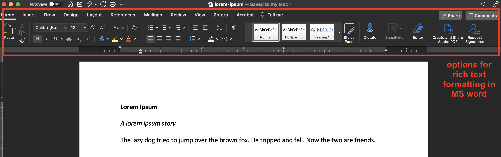

# A plain text workflow for academic writing

## Goals

Practically, this lab is meant to:

  * provide a better sense of why one would choose to do scholarly work in plain text;
  * highlight key languages/softwares associated with writing in plain text;
  * teach you how to:
    - set up a plain text writing environment;
    - execute basic document conversion tasks;
    - use Zotero to manage citations in plain text;

The purpose of this lab is NOT to convince you that plain text writing is the only way to go -- on the contrary! **What we hope most is that this lab introduces you to tools that will prompt reflection about your writing process.** For example, what considerations should you take when approaching scholarly writing in geography? What habits have you developed that you didn't even realize, and what affordances do you rely on that you didn't know you need?

## Overview

After a brief discussion of what plain text writing is and why one would do it, the lab walks you through the software stack required for a plain text writing environment. Over the course of the lab, you'll download a few free, open-source softwares and packages including:

  - A text editor like Atom or VS Code
  - pandoc, a document conversion software
  - TeXShop, a LaTeX editor required for pandoc to work
  - The Zotero extension Better BibTeX, a citation manager

By the end, you'll have the requisite software stack and an example workspace which can serve as as template for future projects.

#### A note...

In this lab, you'll run commands from the [terminal (Mac)](https://en.wikipedia.org/wiki/Terminal_(macOS)) or [command line (Windows)](https://docs.microsoft.com/en-us/windows-server/administration/windows-commands/windows-commands). This can feel intimidating if you've never done it before. In this guide, we'll do our best to emphasize *why* you're doing this or that, as opposed to emphasizing *what buttons* to press.

Most importantly, **it is okay not to fully understand concepts and software introduced in this lab.** The tech stack in a plain text writing workflow is pretty proliferated, and it's decidedly more complex to get set up than writing in MS word. Moreover, the programming world can feel and be really exclusive/exclusionary.

Borrowing from an excellent piece that Kieran Healy wrote about plain text workflows, **I wouldn't suggest anyone use something that I'm not willing to support their learning. If you run into any issues, at any time, drop me a line (ian.spangler@uky.edu) and I'll do my best to help answer questions.**

## Table of Contents

  | Section | Title                       |
  | ------- | --------------------------- |
  |    1    | [Getting started](#1-getting-started) |
  |    2    |                             |
  |    3    |                             |
  |    4    |                             |

## 1. Getting started

### 1.1. What is plain text, anyway?

Well, let's start with what plain text isn't.

#### Rich Text

You're probably familiar with **[rich text](https://en.wikipedia.org/wiki/Rich_Text_Format)**, a shorthand for file formats (`.rtf`, `.doc`) that natively support features like formatting, inline images, and track changes. Microsoft's Word and Apple's Pages are among the most common rich text word processing apps. There's a lot going on under the hood of word processors (code, functions) that makes stuff like font families, alignment, and color just a button click away.

|  |
| ---------------------------------------------------------------- |
| *screenshot of the MS word interface, with rich text formatting options highlighted in the red box*                            |

#### Plain text

Rich text can be contrasted with **[plain text](https://en.wikipedia.org/wiki/Plain_text)**, a shorthand for file formats (`.txt`) that contain no formatting features. This includes files written in [Markdown](https://www.markdownguide.org/getting-started/), a language that allows you to add formatting elements to plain text files with minor alterations such as enclosing text in asterisks. For example, in Markdown, `this text is normal, and **this text is bold**`.

Normally, you compose plain text in **[text editors](https://en.wikipedia.org/wiki/Text_editor)** such as [Atom](https://atom.io/) or [VS Code](https://code.visualstudio.com/insiders). In these interfaces, and [what you see is what you get](https://en.wikipedia.org/wiki/WYSIWYG). There are few, if any, exclusively machine-readable layers of code between you and the words you typed. Graphical elements like font size and boldness are marked explicitly in the document:

|  |
| ------------------------------------------------------ |
| *Screenshot of the text editor Atom, showing from left to right 1) the file tree, 2) a plain text Markdown file, and 3) a rendered Markdown file preview*                   |

### 1.2. Why write in plain text?

The primary benefit of writing in plain text is to **isolate the writing process from the tasks of editing and formatting.**

Rich text editors like MS Word and Google Docs bundle writing (e.g., typing words) and formatting (e.g., choosing fonts, adding italics, and so on) into the same interface.

If the upshot of word processors like these is functionality, then the downsides are busyness, opacity, and propriety. [Dennis Tenen and Grant Wythoff](http://programminghistorian.org/en/lessons/sustainable-authorship-in-plain-text-using-pandoc-and-markdown#philosophy) have done a good job, I think, of explaining the problems with rich text editors:

>When you use MS Word, Google Docs, or Open Office to write documents, what you see is not what you get. Beneath the visible layer of words, sentences, and paragraphs lies a complicated layer of code understandable only to machines. Because of that hidden layer, your .docx and .pdf files depend on proprietary tools to be rendered correctly. Such documents are difficult to search, to print, and to convert into other file formats.

Practically, this means that when we write in Microsoft Word et al., we're often faced with distractions from writing.

To borrow again from Tenen and Wythoff, the idea behind Markdown:

>... is to identify units that are meaningful to humans, like titles, sections, subsections, footnotes, and illustrations. At the very least, your files will always remain comprehensible to you, even if the editor you are currently using stops working or “goes out of business.”

Writing in this way, they go on:

>... liberates the author from the tool. Markdown can be written in any plain text editor and offers a rich ecosystem of software that can render that text into beautiful looking documents.

### 1.3. Downloading your text editor

#### 1.3.1. Pick one!

Before diving in to the nuts and bolts of the plain text workflow, you should download a text editor.

I recommend [Atom](https://atom.io/) -- mainly because I use it and it has a nice suite of plugins for writing prose -- but you can use any one you like. Other simple options include [VS Code](https://code.visualstudio.com/download) and [Sublime](https://www.sublimetext.com/3), and you can get more complex with [Emacs](https://www.gnu.org/software/emacs/download.html) and [Vim](https://www.vim.org/download.php) (although I wouldn't recommend starting with those). For the purposes of this exercise, don't lose too much sleep over picking one over another.

If you go with Atom, check out this [great guide](https://ben.balter.com/2016/12/23/atom-for-prose/) with advice on how to customize your Atom environment for writing prose.

#### 1.3.2. Install with a package manager

If you want to learn how to install this and other softwares using a [package manager](https://en.wikipedia.org/wiki/Package_manager), follow the steps in Section 1.4.

If not, just download the editor of your choice, the way you normally do, and proceed to [Section 2](#2-set-up-your-project-space).

### 1.4. OPTIONAL: Install Atom with a package manager

| This section is specific to MacOS. I apologize that I couldn't do one for Windows, but I don't have a Windows machine :(. |
| ---- |

##### 1.4.1. What's Homebrew?

So, [Homebrew](https://brew.sh/) is a package manager for MacOS. What's that mean and why should you care?

A "package manager" is just a handy script that 1) installs applications and software packages 2) into a sensible directory on your machine. Homebrew works from the Terminal, or the native Mac interface for navigating an operating system via text (as opposed to installing with `.dmg` files in a point-and-click, drag-and-drop fashion).

The terminal is cool because it lets you navigate 

Real programmers and software developers (e.g., not me) like Homebrew and other package managers because it allows them to toggle back and forth between language versions (e.g., sometimes they have to flip between Python 2.7 and Python 3, depending on the project).

Personally, I like Homebrew for ease of use.

##### 1.4.2. Install Homebrew from the Terminal

To install Homebrew, you need to open your Mac's Terminal.

Press `cmd + space` to open the Spotlight, and type `terminal`. You should see this:

Click `return` and the Terminal will open:

Per the instructions on [Homebrew's main page](https://brew.sh/), install Homebrew by copying and pasting the following code into the Terminal, then press `return`:

`/bin/bash -c "$(curl -fsSL https://raw.githubusercontent.com/Homebrew/install/HEAD/install.sh)"`

You don't need to know what this set of commands means right now.

#### 1.4.2. Install Atom using Homebrew

Here's where it gets fun. All you need to do to install Atom is type into your terminal:

`brew install --cask atom`

and press `return`. ¡Voila!

## GRAVEYARD

<!-- ### 1.3.

As academics, we have a complicated relationship to writing. We are constantly doing it. Sometimes we write for six hours and produce a paragraph; sometimes we write for an hour and produce six. We write papers for class, notes for seminars, letters of recommendation, lengthy emails, short emails, emails that never get sent, feedback for our students, grants, proposals, exams, exam answers, research materials, theses, dissertations... the list goes on.

All of this falls more or less into the broad category of "scholarly writing," at least insofar as it's stuff that we have to do for our jobs as scholars. Especially the Big Things---grants, dissertations, and journal manuscripts, for example---require some kind of established workflow.

In this lab, you'll be introduced to one such workflow: **plain text writing**. -->
