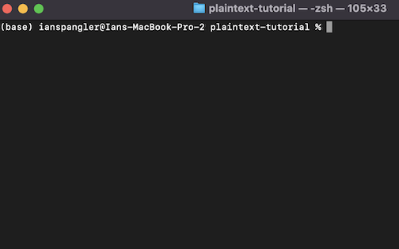
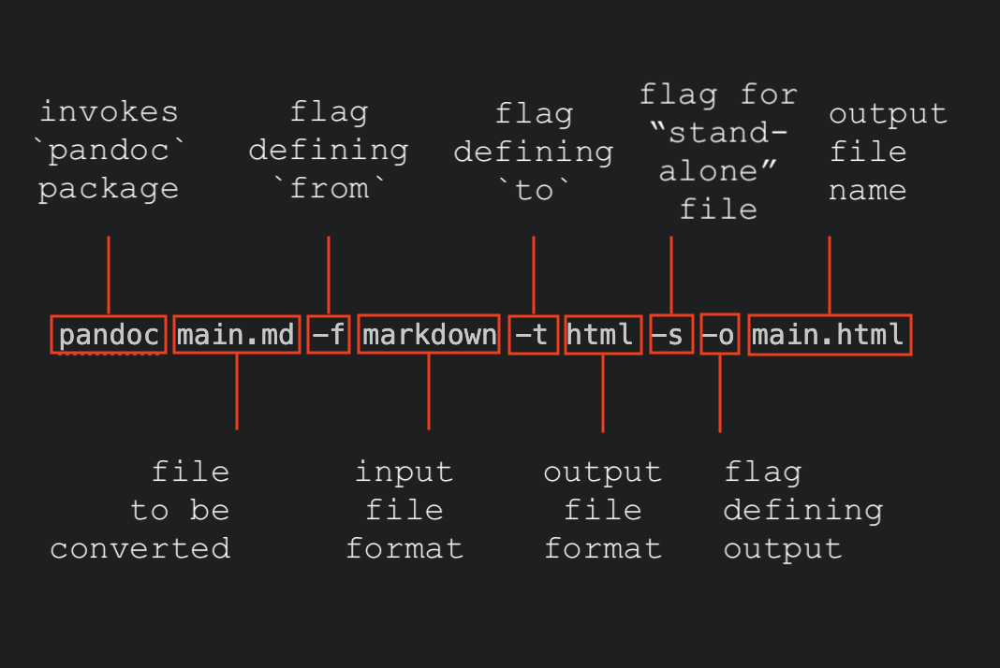

# A PLAIN TEXT WORKFLOW FOR ACADEMIC WRITING

# Goals

Practically, this lab is meant to:

  * provide a better sense of why one would choose to do scholarly work in plain text;
  * highlight key languages/softwares associated with writing in plain text;
  * teach you how to:
    - set up a plain text writing environment;
    - execute basic document conversion tasks;
    - use Zotero to manage citations in plain text;

The purpose of this lab is NOT to convince you that plain text writing is the only way to go -- on the contrary! **What we hope most is that this lab introduces you to tools that will prompt reflection about your writing process.** For example, what considerations should you take when approaching scholarly writing in geography? What habits have you developed that you didn't even realize, and what affordances do you rely on that you didn't know you need?

# Overview

After a brief discussion of what plain text writing is and why one would do it, the lab walks you through installing the software stack required for a plain text writing environment. Over the course of the lab, you'll download a few free, open-source softwares and packages including:

  - A text editor like Atom or VS Code
  - pandoc, a document conversion software
  - The Zotero extension Better BibTeX, a citation manager
  - TeXShop, a software package that automatically handles document formatting

You'll use these libraries and apps to set up a workspace, compose a basic Markdown document, equip it with the power of Zotero, and convert it into a number of other file formats.

### A note...

In this lab, you'll run commands from the [terminal (Mac)](https://en.wikipedia.org/wiki/Terminal_(macOS)) or [command line (Windows)](https://docs.microsoft.com/en-us/windows-server/administration/windows-commands/windows-commands). This can feel intimidating if you've never done it before. In this guide, we'll do our best to emphasize *why* you're doing this or that, as opposed to emphasizing *what buttons* to press.

Most importantly, **it is okay not to fully understand concepts and software introduced in this lab.** The tech stack in a plain text writing workflow is pretty proliferated, and it's decidedly more complex to get set up than writing in MS Word. Moreover, the programming world can feel -- and be -- really exclusive/exclusionary. Put plainly,

Borrowing from an excellent piece that Kieran Healy wrote about plain text workflows, **I wouldn't suggest anyone use something that I'm not willing to support their learning until they feel comfortable using it on their own. If you run into any issues, at any time, drop me a line (ian.spangler@uky.edu) and I'll do my best to help answer questions.**

# Table of Contents

  - [Getting started](#1-getting-started)
  - [Downloading your text editor](#2-downloading-your-text-editor)
  - [Create a project workspace](#3-create-a-project-workspace)
  - [Let's get citational](#4-lets-get-citational)
  - [Coverting with pandoc](#5-converting-with-pandoc)
  - [Conclusion and further reading](#6-conclusion-further-reading)

# 1. Getting started

## What is plain text, anyway?

Well, let's start with what plain text isn't.

### Rich Text

You're probably familiar with **[rich text](https://en.wikipedia.org/wiki/Rich_Text_Format)**, a shorthand for file formats (`.rtf`, `.doc`) that natively support features like formatting, inline images, and track changes. Microsoft's Word and Apple's Pages are among the most common rich text word processing apps. There's a lot going on under the hood of word processors (code, functions) that makes stuff like font families, alignment, and color just a button click away.

|  |
| ---------------------------------------------------------------- |
| *screenshot of the MS word interface, with rich text formatting options highlighted in the red box*                            |

### Plain text

Rich text can be contrasted with **[plain text](https://en.wikipedia.org/wiki/Plain_text)**, a shorthand for file formats (`.txt`) that contain no formatting features. This includes files written in [Markdown](https://www.markdownguide.org/getting-started/), a language that allows you to add formatting elements to plain text files with minor alterations such as enclosing text in asterisks. For example, in Markdown, `this text is normal, and **this text is bold**`.

Normally, you compose plain text in **[text editors](https://en.wikipedia.org/wiki/Text_editor)** such as [Atom](https://atom.io/) or [VS Code](https://code.visualstudio.com/insiders). In these interfaces, [what you see is what you get](https://en.wikipedia.org/wiki/WYSIWYG). There are few, if any, exclusively machine-readable layers of code between you and the words you typed. Graphical elements like font size and boldness are marked explicitly in the document by asterisks and pound signs:

|  |
| ------------------------------------------------------ |
| *Screenshot of the text editor Atom, showing from left to right 1) the file tree, 2) a plain text Markdown file, and 3) a rendered Markdown file preview*                   |

## 1.2. Why write in plain text?

The primary benefit of writing in plain text is to **isolate the writing process from the tasks of editing and formatting.**

Rich text editors like MS Word and Google Docs bundle writing (e.g., typing words) and formatting (e.g., choosing fonts, adding italics, and so on) into the same interface.

The upshot of word processors like these is extended functionality.

The downsides are busyness, opacity, and propriety. [Dennis Tenen and Grant Wythoff](http://programminghistorian.org/en/lessons/sustainable-authorship-in-plain-text-using-pandoc-and-markdown#philosophy) have done a good job, I think, of explaining the problems with rich text editors:

>When you use MS Word, Google Docs, or Open Office to write documents, what you see is not what you get. Beneath the visible layer of words, sentences, and paragraphs lies a complicated layer of code understandable only to machines. Because of that hidden layer, your .docx and .pdf files depend on proprietary tools to be rendered correctly. Such documents are difficult to search, to print, and to convert into other file formats.

Practically, this means that when we write in Word et al., we're often doing tasks that are **not writing**. This is not by accident, but by design.

So, what can you do about it?

This is where plain text becomes useful.

A plain text workflow will typically proceed something like this:

  1. Define a workspace for your project
  2. Using a text editor, compose all your writing in Markdown
  3.

# 2. Downloading your text editor

## 2.1. Pick one!

Before diving in to the nuts and bolts of the plain text workflow, you should download a text editor.

I recommend [Atom](https://atom.io/) -- mainly because I use it and it has a nice suite of plugins for writing prose -- but you can use any one you like. Other simple options include [VS Code](https://code.visualstudio.com/download) and [Sublime](https://www.sublimetext.com/3), and you can get more complex with [Emacs](https://www.gnu.org/software/emacs/download.html) and [Vim](https://www.vim.org/download.php) (although I wouldn't recommend starting with those). For the purposes of this exercise, don't lose too much sleep over picking one over another.

If you go with Atom, check out this [great guide from Ben Balter](https://ben.balter.com/2016/12/23/atom-for-prose/) with advice on how to customize your Atom environment for writing prose. [Scott Selisker](http://u.arizona.edu/~selisker/post/workflow/) has got a similarly excellent set of suggestions for customizing Atom in his plain text workflow guide.

If you want to learn how to install this and other softwares using a [package manager](https://en.wikipedia.org/wiki/Package_manager), follow the steps in Section 2.2.

If not, just download the editor of your choice, the way you normally do, and proceed to [Section 3](#3-set-up-your-project-space).

## 2.2. OPTIONAL: Install with a package manager

| If you're on a Windows machine, you should be able to do everything in this section if you use [command line](https://docs.microsoft.com/en-us/windows-server/administration/windows-commands/windows-commands) instead of Terminal, and [Chocolatey](https://chocolatey.org/install) instead of Homebrew. |
| ---- |

### 2.2.1. What's Homebrew?

[Homebrew](https://brew.sh/) is a package manager for MacOS. What's that mean and why should you care?

A "package manager" is just a handy program that 1) installs applications and software packages 2) into a sensible directory on your machine. You can only use Homebrew from Terminal, the native Mac interface for navigating an operating system via text commands. This is in contrast to something like the [Finder app](https://en.wikipedia.org/wiki/Finder_(software)), a [graphical user interface](https://en.wikipedia.org/wiki/Graphical_user_interface) that relies on point-and-click, drag-and-drop commands.

Real programmers and software/app developers (e.g., not me) are fond of Homebrew and other package managers because it allows them to toggle back and forth between language versions (e.g., sometimes they have to flip between Python 2.7 and Python 3, depending on the project).

I don't really do this. Personally, I like Homebrew for the ease of use. Installing new programs with it is fast, easy, and clean. I hope you like it too!

### 2.2.2. Install Homebrew from the Terminal

To install Homebrew, you first need to open your Mac's Terminal.

Press `cmd + space` to open the Spotlight, and type `terminal`. You should see this:

|  |
| --------------------------------------------------------------- |
| *View of `terminal`                                                               search in Spotlight*  |

Click `return` and the Terminal will open:

|  |
| -------------------------------------------- |
| *View of Terminal app*                                             |

[Here's a cheatsheet](https://github.com/0nn0/terminal-mac-cheatsheet) with a bunch of Terminal commands.

Per the instructions on [Homebrew's main page](https://brew.sh/), install Homebrew by copying and pasting the following code into Terminal, then press `return`:

`/bin/bash -c "$(curl -fsSL https://raw.githubusercontent.com/Homebrew/install/HEAD/install.sh)"`

You don't need to know what this code means. After you run it, you'll see a lot more code start plowing through the terminal. Don't worry about that either.

To confirm Homebrew was installed, type `brew --version` and hit `return`. If the Terminal prints a Homebrew version, you're good to proceed.

If you run into issues with this, feel free to shoot me an email.

### 2.2.3. Install Atom using Homebrew

And now, the payoff -- all you need to do to install Atom is type into your terminal:

`brew install --cask atom`

and press `return`. ¡Voila!

You can easily figure out whether any software program or application is installable via Homebrew with a web search for `brew install <app>` where `<app>` = the application you want, like so:

|  |
| --------------------------------------------------------------------- |
| A google search for homebrew install Atom                                                                      |

Once you've done this, you you'll be able to find Atom in your Applications folder. Open it up, and move on to Section 3!

# 3. Create a project workspace

Create a folder, in a sensible place on your computer, where this lab will live. (I created a folder in the GitHub repository for this working group.) Name the folder `I I’m flow`. This will be your "project workspace."

In Atom, select `file` -> `Add project folder...` and add the workspace you created:

|  |
| ----------------------------------- |
| *Adding a project folder to Atom*             |

You should now see this folder appear in the **file tree pane** on the left hand side of Atom. Right-click on the `example-workflow` folder, select `New File`, and title the new file `main.md`.

The **Markdown file** that you created should open automatically. Copy the following text and paste it into `main.md`, replacing the text between `< >` where appropriate:

        ---
        title: <your name>'s project
        author: <your name>
        date: <today's date as xx/xx/xxxx>
        ---
        # Section 1

        Welcome to my document, which contains many fantastic ideas! Read on...

        ## Subsection 1.1

        Lorem ipsum dolor sit amet, consectetur adipisicing elit, sed do eiusmod tempor incididunt ut labore et dolore magna aliqua. Ut enim ad minim veniam, quis nostrud exercitation ullamco laboris nisi ut aliquip ex ea commodo consequat.

        ## Subsection 1.2

        Sed ut perspiciatis unde omnis iste natus error sit voluptatem accusantium doloremque laudantium, totam rem aperiam, eaque  ipsa quae ab illo inventore veritatis et quasi architecto beatae vitae dicta sunt explicabo.

Think of this file -- `main.md` -- as the primary document in which you'll draft your writing. You can name it whatever you want (but as we'll see later, a shorter name is better). Whatever you call it, this document will be at the center of your project workspace.

Before moving on to the next section, now would be a good time to fiddle around with Markdown, especially if you've never used it before. Some useful resources for writing in Markdown:
  - [Markdown's official documentation](https://www.markdownguide.org/getting-started/)
  - [A great cheatsheet for Markdown syntax](https://github.com/adam-p/markdown-here/wiki/Markdown-Cheatsheet)
  - [A Markdown table generator](https://www.tablesgenerator.com/markdown_tables)

# 4. Let's get citational

For scholarly writing, perhaps the most important question in any workflow is how to manage citations and bibliographies. Kieran Healy, in a [wonderful guide to plain text writing](https://plain-text.co/index.html), puts it well:

>"[D]oing scholarly work is intrinsically a mess. There’s the annoying business of getting ideas and writing them down, of course, but also everything before, during, and around it: data analysis and all that comes with it, and the tedious but unavoidable machinery of scholarly papers—especially citations and references. There is a lot of keep track of, a lot to get right, and a lot to draw together at the time of writing.

Thankfully, there are great ways to address this indispensable part of scholarship in a plain text workflow -- and they begin with Zotero.

## Zotero + Better BibTeX

Zotero is a very extensible application, with lots of handy plugins. One of them is [Better BibTeX](https://retorque.re/zotero-better-bibtex/). According to its website, Better BibTeX is built specifically to make "it easier to manage bibliographic data, especially for people authoring documents using text-based toolchains (e.g. based on LaTeX / Markdown)."

To install this add-on:

  1. At [this page](https://github.com/retorquere/zotero-better-bibtex/releases/tag/v6.5.1), download the file `zotero-better-bibtex-6.5.1.xpi` by clicking on it
  2. Open Zotero
  3. Click `Tools` -> `Add-ons`
  4. Click the `Extensions` button
  5. Click on the gear in the top-right corner and choose `Install Add-on From File…`
  6. Choose .xpi that you’ve just downloaded, click `Install`
  7. Restart Zotero

After the initial installation, the plugin will auto-update to newer releases, so you should need to perform the process described here only once.

## What a cite to see!

Using our newfound power of citation, let's plug some references into our `main.md` project file.

Remember that Zotero library you made during the Session 1 exercises? We're going to export this to a plain text bibliography file (with `.bib` extension), which will make it compatible with our plain text workflow. To do so:

  1. Navigate to your library (I'm just using a Zotero folder from my qualifying exams in this example)
  2. Select all of the entries in the library (e.g., click on one entry and then press `cmd + A`)
  3. Right-click -> `Export items`
  4. Choose `Better BibTeX` as the format
  5. Leave other boxes unchecked and click `OK`
  6. Navigate to your project directory, `example-workflow`, and save this file as `main.bib`

Now, your project workspace should contain two files: `main.md` and `main.bib`. In theory, `main.bib` is a self-contained plain text file containing only references associated with this project.

| Note: I've used 'dummy' file names for everything in this lab, but if it makes more sense for you to name your files with topical descriptors, go right ahead. I like the idea of naming the top-level folder with a descriptor, e.g., the folder `dissertation_ch1` contains `main.md` and `main.bib`. |
| -------------------- |

First, open `main.bib`. Take a look around. These files basically just contain structured metadata about each reference. Importantly, each entry begins with a unique identifier that immediately follows the first curly brace `{`. This unique ID is key, literally: it's called a **citekey**, and it will allow you to quickly and easily cite any item from your `.bib` file by simply typing `[@]`.

For this next step to work, it's important that you do not close `main.bib`. Leave it open!

Next, pick a reference. Any reference! Let's call this Reference A. Remember the citekey of Reference A. It's easy to remember because all citekeys *should* begin with the author's last name.

Finally, open `main.md` and write a sentence. It can have something to do with the references in your `.bib` file, or not. Either way, you're going to attribute this idea to Reference A. At the end of the sentence, type `[@<citekey>]`, where `<citekey>` = Reference A.

Once you get a couple of letters in, you should actually see the citation start to autofill, like so:

|  |
| ------------------------------------- |
| *The citation in my `main.md` document beginning to autofill*                                      |

Pretty cool! You can imagine how this could come in handy, especially for long projects like dissertation chapters or journal manuscripts -- and we haven't even tapped into the full functionality yet.

In the next section on document conversion, we'll test out a few commands using a software called **pandoc**. In addition to easily converting files from `.md` to `.docx` and more, pandoc allows you to dynamically create a full bibliography, based on the items from `main.bib` you have cited in `main.md`.

To me, this is among the most powerful functionalities of the plain text workflow.

# 5. Converting with pandoc

## Getting started

So you're ready to share your brilliant writing with the world, but all you've got is a crummy Markdown document? pandoc is here to save the day!

[pandoc](https://pandoc.org/) is a software for document conversion. Your Markdown document `main.md` is for writing -- when you need to share, use pandoc to transform that document into `.docx`, `.pdf`, or any other format you like.

pandoc requires you to execute tasks from the command line. This can be intimidating if you've never done it before, but once you know how to do it, you will probably find it hard to return to point-and-click stuff. Also, you'll look like you're hacking into the mainframe every time you export a file to a Word doc. Nice!

See a cheatsheet for [Windows terminal commands here](http://www.cs.columbia.edu/~sedwards/classes/2015/1102-fall/Command%20Prompt%20Cheatsheet.pdf), and one for [MacOS here](https://github.com/0nn0/terminal-mac-cheatsheet).

| Note: the next section is copied near-verbatim from pandoc's "[Getting started](https://pandoc.org/getting-started.html)" page. It involves navigating the command line and it has instructions for both Windows and Mac. |
| ---- |

## Step 1: Install pandoc

If you opted to [install Homebrew during Section 2.2](), you can install pandoc via Homebrew by executing this line of code in the terminal:

    brew install pandoc

To install pandoc with a Mac or Windows installer, follow instructions [at this page](https://pandoc.org/installing.html).

## Step 2: Open a terminal

As mentioned above, pandoc is a command-line tool. There is no graphic user interface. So, to use it, you’ll need to open a terminal window.

### MacOS

On MacOS, the Terminal application can be found in `/Applications/Utilities` or by typing `terminal` into the `Spotlight` app (`cmd + space`).

### Windows

On Windows, you can use either the classic command prompt or the more modern PowerShell terminal. If you use Windows in desktop mode, run the `cmd` or `powershell` command from the Start menu. If you use the Windows 8 start screen instead, simply type `cmd` or `powershell`, and then run either the “Command Prompt” or “Windows Powershell” application. If you are using `cmd`, type chcp 65001 before using pandoc, to set the encoding to UTF-8.

### Linux

[See pandoc's website](https://pandoc.org/getting-started.html#step-2-open-a-terminal) for Linux configuration.

### Confirm pandoc is installed

Once you've opened your terminal, you should see a rectangle with a “prompt” (possibly just a symbol like %, but probably including more information, such as your username and directory), and a blinking cursor.

Let’s verify that pandoc is installed. Type

    pandoc --version

and hit enter. You should see a message telling you which version of pandoc is installed, as well as some additional information.

## Step 3: Changing directories

The terminal is just another way of navigating through files on your computer. Just like any other file finder, you navigate it through specific "places" (e.g., folders). First, let’s see where we are. Type

    pwd

on Linux or MacOS, or

    echo %cd%

on Windows, and hit enter. Your terminal should **print** your current **working directory**. (Unrelatedly, guess what `pwd` stands for?)

Let’s navigate now to our project directory, `example-workflow`. Type `ls` and hit enter. You'll see all the files and folders in your current directory. Type

    cd Documents

and hit enter. Now type

    `pwd` (or `echo %cd%` on Windows)

again. You should be in the `Documents` subdirectory of your home directory. To go back to your home directory, you could type

    cd ..

The `..` means “one level up.”

Return to your Documents directory and navigate to your project workspace, `example-workflow`, by typing `cd <destination>` where `<destination>` is the next folder that contains `example-workflow`.

If you ever get lost, use:
  1. `pwd` (or `echo %cd%`) to view your current directory
  2. `ls` to view all files in your current directory
  3. `cd ..` to go "one above" your current directory

That’s all you need to know for now about using the terminal. But here’s a secret that will save you a lot of typing. You can always type the up-arrow key to go back through your history of commands. So if you want to use a command you typed earlier, you don’t need to type it again: just use up-arrow until it comes up. Try this. (You can use down-arrow as well, to go the other direction.) Once you have the command, you can also use the left and right arrows and the backspace/delete key to edit it.

Most terminals also support tab completion of directories and filenames. To try this, first go back one level above your project workspace by typing:

    cd ..

Now, type

    cd example-

and hit the tab key instead of enter. Your terminal should fill in the rest (`workflow`), and then you can hit enter. **This will save you a LOT OF TIME if your folders have spaces in them. If your folders have spaces in them, you will need to prefix every space with `\`.** For example, to `cd` into a folder titled `example workflow`, you'd need to type `cd example\ workflow`, which is a pain in the butt.

## Step 4 (OPTIONAL): Using pandoc as a filter

Type

    pandoc

and hit enter. You should see the cursor just sitting there, waiting for you to type something. Type this:

    Hello *pandoc*!

    - one
    - two

When you’re finished (the cursor **must be at the beginning of the next line**), type `Ctrl-D` on MacOS or Linux, or `Ctrl-Z` followed by `Enter` on Windows. You should now see your text converted to HTML!

    
Hello <em>pandoc</em>!

    <ul>
    <li>one</li>
    <li>two</li>
    </ul>

What just happened? When pandoc is invoked without specifying any input files, it operates as a “filter,” taking input from the terminal and sending its output back to the terminal. You can use this feature to play around with pandoc.

By default, input is interpreted as pandoc markdown, and output is HTML (if you're not familiar with HTML syntax, you can read the [basics here](https://www.w3schools.com/html/html5_syntax.asp)).

We can change that output, if we want. Let’s try converting from HTML to markdown:

    pandoc -f html -t markdown

Now type:

    
Hello <em>pandoc</em>!

and hit `Ctrl-D` (or `Ctrl-Z` followed by `Enter` on Windows). You should see:

    Hello *pandoc*!

## Step 5: Converting a file

In the terminal, confirm that you're in your project workspace by typing `pwd`.

Now type

    ls

(or dir if you’re on Windows). You should see your working document, `main.md`.

### Convert to HTML

To convert it to HTML, copy and paste the following command directly into your terminal:

    pandoc main.md -f markdown -t html -s -o main.html

Here's how this command breaks down:

  1. `pandoc` invokes the software library
  2. `main.md` tells pandoc which file to convert
  3. `-f markdown` specifies the format you're converting from
  4. `-t html` is the format you're converting to
  5. `-s` tells pandoc to create a “standalone” file, with a header and footer, not just a fragment
  6. `-o test1.html` says to put the output in the file test1.html.

  Note that we could have omitted `-f markdown` and `-t html`, since pandoc's default behavior is to convert from markdown to HTML -- but it doesn’t hurt to include them.

|  |
| --------------------------------------------------------- |
| *description of pandoc flags* flags                                                          |

Check that the file was created by typing

    ls

and pressing `enter`. You should see main.html. Now open this in a browser. On MacOS, you can type

    open main.html

On Windows, type

    .\main.html

You should see a browser window with your document.

### Convert to a Word document

Now try creating a Word document (with extension `.docx`). Try using the `^` arrow to find your previous conversion command, and replacing `main.html` with `main.docx`.

After converting from Markdown, open your shiny new Word doc with

    open main.docx

and inspect it. You should see something like this:

|  |
| ---------------------------------------------------------- |

Looks okay, right? Sure -- but it doesn't look *great*. There are two things missing here: a bibliography, and some nice formatting. Thankfully, they're both easy to add.

Close `main.docx` before moving on to the next section.

### Add a bibliography

At this point, you should have four files in your folder `example-workspace`: `main.md`, `main.bib`, `main.html`, and `main.docx`.

After making two small changes to `main.md`, pandoc will be smart enough to parse that reference you added in Section 4, and automatically create a bibliography from it.

First, add a new line, `bibliography: main.bib` in the front matter of `main.md` so that it reads:

    ---
    title: Ian's project
    author: Ian Spangler
    date: 04/21/21
    bibliography: main.bib
    ---

For the sake of formatting, you should also add

    # Bibliography

at the very bottom of your `main.md` document.

Second, add another flag to the conversion command you used above. That flag is `--citeproc`, and you can add it right after `main.md`. All together (minus the stuff we don't need), it'll look like:

    pandoc main.md --citeproc -o main.docx

Execute this command and then enter

    open main.docx

You should now see a Word document with a full-throated bibliography! Note how pandoc was able to add *only the references that appeared in `main.md`* when importing from `main.bib`.

|  |
| ------------------------------------------ |

Neat!

### Add formatting

Having a bibliography is great, but it would be even better if we could choose to export this Markdown file into a fully formatted Word document. Thankfully, there's a flag we can add for that too!

The flag `--reference-doc` will tell pandoc to look for a reference document in the current directory, and format the output according to it.

I made a sample reference document, which you can download [at this link](https://github.com/itspangler/research-writing-data/blob/main/02_writing/example-workflow/custom-reference.docx) (the `Download` button is on the right hand of the screen). Download it, and move it to your project workspace in `example-workflow`.

After you've done so, go ahead and run the conversion command again, except this time, add the flag `--reference-doc=custom-reference.docx` after `--citeproc`. The command should read:

    pandoc main.md --citeproc --reference-doc=custom-reference.docx -o main.docx

You should see something close to this:

|  |
| --------------------------------------------------------- |

Finally, you can use the flag `--number-sections` if you want to automate adding numbers in front of the headers:

  pandoc main.md --citeproc --reference-doc=custom-reference.docx --number-sections -o main.docx

The output will look something like:

### Convert to PDF (OPTIONAL)

If you want to create a PDF, you’ll need to have [LaTeX](https://www.latex-project.org/about/) installed. See MacTeX on OS X, MiKTeX on Windows, or install the texlive package on Linux. Then do

    pandoc test1.md -s -o test1.pdf

### Wrapping up

You now know the basics. Pandoc has a lot of options. At this point you can start to learn more about them by reading the [User’s Guide](https://pandoc.org/MANUAL.html). If there's a formatting feature that you think you want, pandoc probably has it!

# 6. Conclusion and further reading

If you're still reading this, first off: thank you for diving down the plain text rabbit hole with me. I hope that this was a fun set of exercises, or that you learned something, or, at least, that you learned you **hate** something and will never do it again (which is okay).

If you can believe it, I have some recommendations for further reading if you found this interesting. I'm including in that list the posts and articles that helped me create this tutorial.

-
